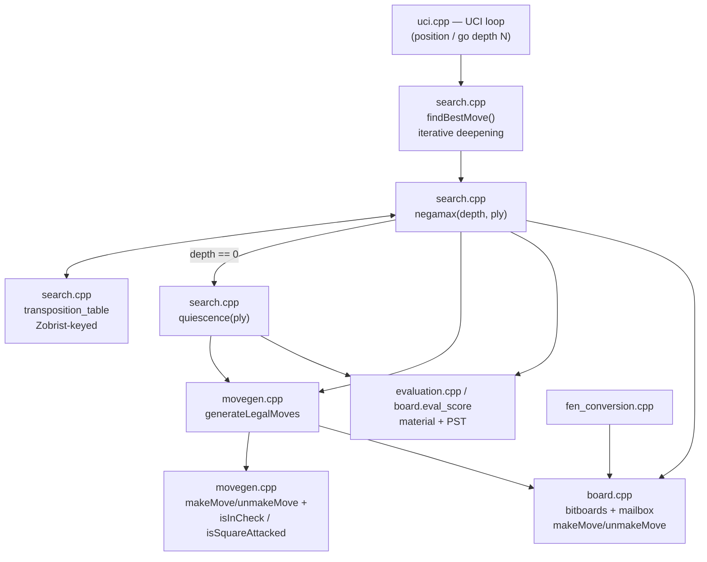

# Chess Engine


A UCI chess engine in C++20 — bitboard move generation with pin/check-mask
legality filtering, negamax alpha-beta search with a Zobrist-hashed
transposition table, single-threaded and deterministic by design.

> 🎥 Demo GIF/terminal recording: **TODO** — not yet captured.

---

## Headline Result: Perft Correctness

No rated playing strength yet (see [Benchmarks](#benchmarks)), so the
strongest verifiable claim right now is move-generator correctness — the
standard proof a chess engine's legality logic has no hidden bugs:

| Position | Depth | Nodes | Time | NPS |
|---|---|---|---|---|
| Start position | 6 | 119,060,324 | 2.131 s | 55.9M |
| [Kiwipete](https://www.chessprogramming.org/Perft_Results#Position_2) | 5 | 193,690,690 | 3.361 s | 57.6M |

Both node counts match the published reference values exactly. Kiwipete
specifically exercises castling rights, en passant, and promotions — the
edge cases a naive move generator usually gets wrong. Measured on Apple M3,
single-threaded, Release build (`cmake -S . -B build`, no explicit flags —
see [Build](#build)). See [Benchmarks](#benchmarks) for methodology and
search NPS.

---

## Overview

The board is a bitboard-per-(piece, color) representation (`uint64_t[6][2]`),
with a mailbox array (`piece_on_square[64]`) kept in sync alongside it purely
as an O(1) "what's on this square" cache — the bitboards are the source of
truth. Move legality is verified by generating pseudo-legal moves and, for
each candidate, actually playing it via `makeMove`, checking whether the
mover's own king is left in check, then `unmakeMove` — the straightforward
approach, at the cost of a full make/unmake pair per candidate move rather
than a precomputed check-mask/pin-ray shortcut. Search is negamax with
alpha-beta and PVS, with move ordering (MVV-LVA + killer moves + history +
TT best-move) and a transposition table doing the pruning work. Sliding-piece
attacks are still naive ray-tracing rather than magic bitboards: a deliberate
correctness-first tradeoff (see [Roadmap](#roadmap)).

---

## Features

- **Board:** bitboard representation with incremental `makeMove`/`unmakeMove`
  (no full recompute per move) for material+PST eval, Zobrist key, and
  castling/en-passant/halfmove bookkeeping.
- **Move generation:** pseudo-legal generation per piece type, filtered to
  fully legal via make/unmake per candidate (play the move, check whether
  the mover's own king is in check, unmake it).
- **Search:** iterative deepening, MVV-LVA capture ordering, Zobrist-hashed
  transposition table (single-threaded, depth-preferred replacement,
  mate-distance-corrected scores), quiescence search over captures with a
  bounded check-evasion extension (depth 2).
- **Evaluation:** material + piece-square tables, White-relative.
- **Protocol:** UCI — `uci`, `isready`, `ucinewgame`, `position`
  (`startpos`/`fen`, with `moves`), `go depth N`, `quit`. Time management is
  supported: `go wtime .. btime .. winc .. binc ..` (with optional
  `movestogo`) or `go movetime N` compute a per-move time budget with a
  safety margin, enforced by `findBestMove`'s deadline check inside
  iterative deepening; `go depth N` (or a bare `go`) still searches to a
  fixed depth with no clock involved.
- **Concurrency:** single-threaded and deterministic throughout — no
  `std::atomic`, no threads, by explicit design choice, not an oversight.

---

## Build

Requires CMake ≥ 3.20 and a C++20 compiler.

```sh
cmake -S . -B build
cmake --build build -j
```

Produces `build/src/chess_engine`. Build type defaults to `Release` when
unspecified.

Run the perft + search NPS benchmark used for the numbers in this README:

```sh
./build/src/chess_engine bench
```

---

## Usage

The engine speaks UCI over stdin/stdout:

```
$ ./build/src/chess_engine
uci
id name ChessEngine
id author roniosipov
uciok
isready
readyok
position startpos moves e2e4 e7e5
go depth 6
bestmove g1f3
quit
```

**GUI hookup (Cute Chess / Arena):** point the GUI at
`build/src/chess_engine` as a UCI engine. Wall-clock time controls work
normally — `wtime`/`btime`/`winc`/`binc`/`movestogo` are read and turned
into a per-move budget. A fixed-depth or "node/depth limit" time control
also works: the engine falls back to `go depth N` (or a 6-ply default for a
bare `go`) whenever no clock info is sent.

---

## Architecture



| Module | Files | Responsibility |
|---|---|---|
| Board | `include/board.hpp`, `src/board.cpp`, `include/types.hpp` | Bitboards + mailbox cache, make/unmake, incremental eval + Zobrist maintenance |
| Move generation | `include/movegen.hpp`, `src/movegen.cpp` | Pseudo-legal generation, make/unmake-based legality filtering |
| FEN | `include/fen_conversion.hpp`, `src/fen_conversion.cpp` | FEN ↔ `Board` conversion |
| Evaluation | `include/evaluation.hpp`, `src/evaluation.cpp` | Material + PST, White-relative |
| Search | `include/search.hpp`, `src/search.cpp` | Negamax + alpha-beta, iterative deepening, MVV-LVA, TT, quiescence |
| Perft | `include/perft.hpp`, `src/perft.cpp` | Node-count correctness validation |
| Benchmark | `include/benchmark.hpp`, `src/benchmark.cpp` | Perft + search NPS benchmarking (`bench` CLI subcommand) |
| UCI | `include/uci.hpp`, `src/uci.cpp` | Protocol loop |
| Entry point | `src/main.cpp` | Dispatches to the UCI loop or `bench` |

---

## Benchmarks

### Perft (correctness)

| Position | Depth | Nodes | Time | NPS |
|---|---|---|---|---|
| Start position | 6 | 119,060,324 | 2.131 s | 55.9M |
| Kiwipete | 5 | 193,690,690 | 3.361 s | 57.6M |

Both exactly match [published reference counts](https://www.chessprogramming.org/Perft_Results).
The automated test suite (see [Testing](#testing)) additionally validates
start position (depth 1–5), Kiwipete (depth 1–4), and a rook endgame
(depth 1–5) against exact reference counts on every run.

### Search NPS

Depth-6 search over a small fixed position suite (start, Kiwipete, a sparse
endgame, a tactical middlegame with pins/promotions):

| Position | Nodes | Time | NPS |
|---|---|---|---|
| Start position | 439,519 | 0.049 s | 9.0M |
| Kiwipete | 1,157,911 | 0.183 s | 6.3M |
| Endgame | 24,955 | 0.004 s | 6.6M |
| Tactical | 347,950 | 0.046 s | 7.5M |
| **Overall** | 1,970,335 | 0.288 s | 6.8M |

Search NPS is lower than perft NPS because it also does TT probes,
move-scoring, and evaluation per node, not just legal-move generation.

**Methodology:** `./build/src/chess_engine bench`, Release build (no
explicit `CMAKE_BUILD_TYPE`), Apple M3, single core, single run — not
averaged across repeated runs. Reproduce with the same command.

### Strength (ELO)

**Not yet measured.** No self-play SPRT or rating-pool result exists — this
is an explicit gap, not an omission, and is listed in
[Roadmap](#roadmap) rather than filled with a placeholder number.

---

## Testing

```sh
cmake -S . -B build -DCHESS_ENGINE_BUILD_TESTS=ON
cmake --build build -j
cd build && ctest --output-on-failure
```

Five suites (`board`, `fen`, `movegen`, `perft`, `zobrist`), covering:
move generation legality (pins, checks, castling, en passant, promotions),
FEN round-trips, make/unmake invariants, and perft node counts against
known-exact reference values at multiple depths and positions. Test targets
are compiled with `-UNDEBUG` unconditionally, independent of
`CMAKE_BUILD_TYPE` — so `assert()`-based checks fire even under the
project's default `Release` configuration instead of silently compiling out.

---

## Roadmap

- **Draw detection** (50-move rule, threefold repetition) — `halfmove_clock`
  is already tracked through make/unmake and FEN round-trips but not yet
  read by search.
- **Magic bitboards** for sliding-piece attacks, replacing the current
  ray-tracing — the largest remaining raw NPS lever once correctness-first
  scope allows revisiting it.

---

## License

No license file yet.

---

## Acknowledgments

- [Chess Programming Wiki](https://www.chessprogramming.org/) — perft
  reference positions and node counts (start position, Kiwipete) used for
  correctness validation; general reference for bitboard, negamax, and
  Zobrist hashing techniques.
